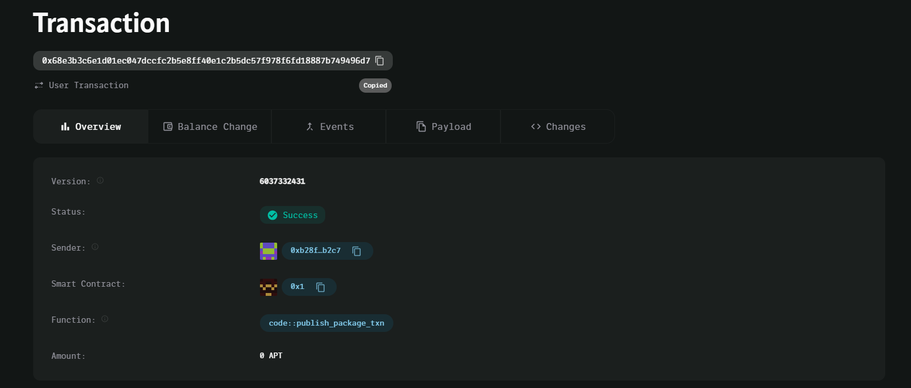

# 0x68e3b3c6e1d01ec047dccfc2b5e8ff40e1c2b5dc57f978f6fd18887b749496d7

# FreelanceMarketplace Smart Contract

## Vision

The **FreelanceMarketplace** smart contract facilitates a decentralized marketplace where employers can post jobs and freelancers can be paid upon job completion. This system ensures transparency and security by locking payments in the contract and releasing them only when the job is marked as complete.

## Features

- **Post Job**:
  - Employers can post jobs by specifying the freelancer and the agreed payment amount.
- **Complete Job & Release Payment**:
  - Once the job is completed, the employer can mark it as finished, and the payment is transferred to the freelancer.

## Future Scope

1. **Escrow System**:

   - Introduce an escrow mechanism where payment is locked until both parties confirm job completion.

2. **Job Ratings**:

   - Implement a rating system for both freelancers and employers to ensure quality and trust in the marketplace.

3. **Multi-Token Support**:
   - Enable payments in various cryptocurrencies, providing more flexibility for employers and freelancers.

The **FreelanceMarketplace** contract streamlines the process of job posting and payment, ensuring security and transparency in freelance transactions.
